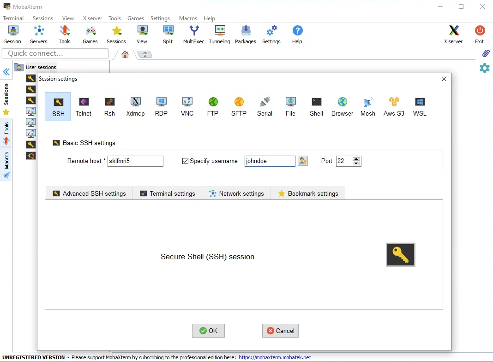
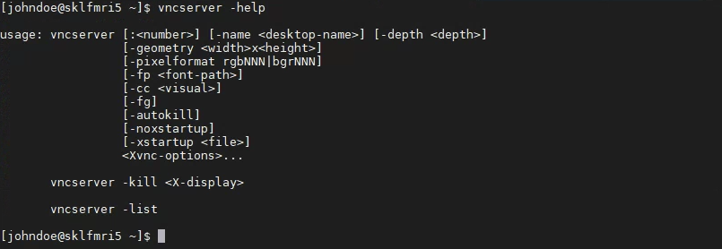
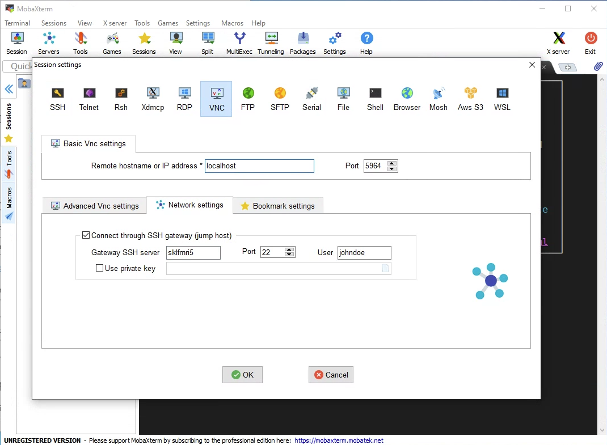
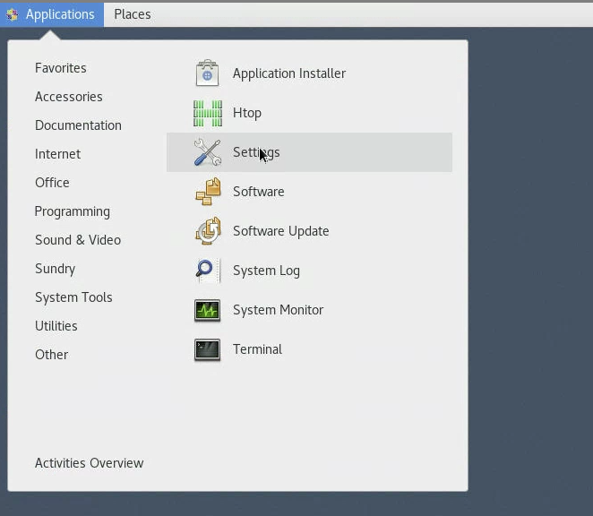
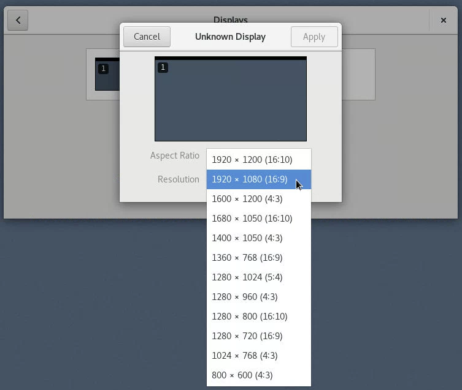
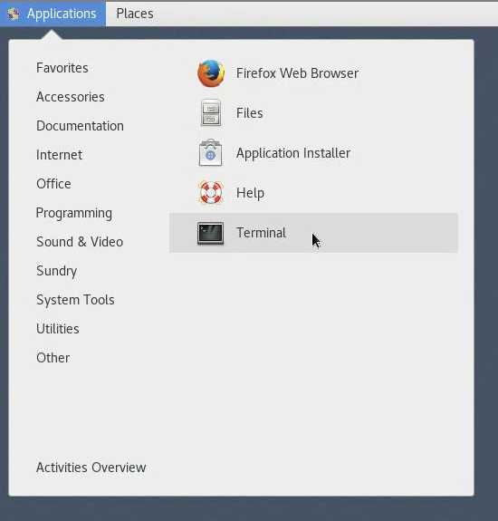
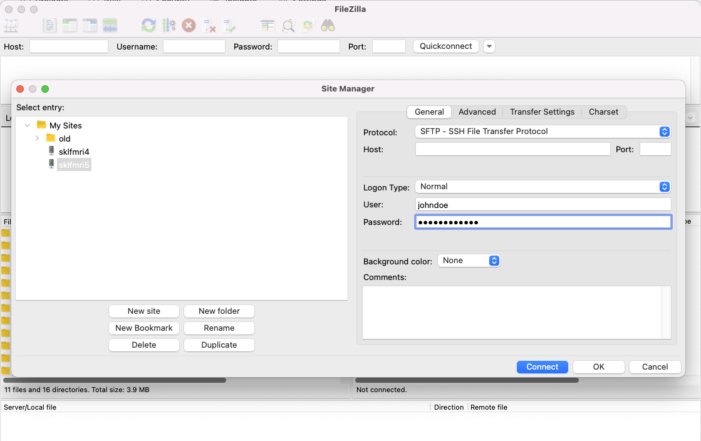

Remote Access
#############

Summary
*******

The server is accessible within HKU Network. Remote desktop is also available. 
If you wish to access the server outside HKU network, you will need to use HKU VPN.
See the relevant sections below for details.

Account Application
*******************

You will first need an account. Please contact IT personnel for it.

You will also need to tell them to create project folders. 
The project folder follows some structures, so that other users could follow up even if you left the lab.
Please also read the project management page for further information

SSH - Secure Shell
******************

SSH is the first entry to the server. For Windows users, it is advised to use MobaXterm for remote access. 
It provides not only the secure shell, but also a VNC client, with which you could use the desktop service.

For Mac and iPad, I would recommend `Remoter <https://remoterlabs.com>`__. It is a paid software.

VNC - Virtual Network Computing
*******************************

VNC is a remote desktop service. Graphical User Interfaces will be provided, and you can use the server like your desktop.

MobaXterm
*********

Download from the `MobaXterm website <https://mobaxterm.mobatek.net/download.html>`__. It is a free software.

After you installed the software, you will need to create a SSH session.

The terminal will be started and ask for your password.

For further information using the shell, you will need to see the *BASH tutorial*.

Starting VNC
************

For now, you will want to use the VNC server.

You can type the command below to see the help

.. code-block:: Bash

  vncserver --help
  

As you can see from the help, you can specify the display number and the resolution of your vnc desktop. You can start the server now.

.. code-block:: Bash

  vncserver :64 -geometry 1920x1200
  

A server will be started at display number 64, with a resolution of 1920x1200. If you have a bigger screen, you can adjust the resolution.

.. warning::

  Please replace the number 64 with any number you like (1-99, please).

It will prompt you for a password for full access. It can be different from the one you login to the server, but it will be a challenge to your memory.

It will then ask you if you will want to create a "Read Only" password. You will probably need none.

You can then go back to the MobaXterm to create a VNC session.

Creating VNC session
********************

Go back to the MobaXterm. Click the Session button.

.. note::

  A few things to note. 
  
  First, in the Network settings panel, you are actually connecting to the server through SSH, then create a tunnel to connect to the VNC server.
  
  Second, the remote hostname is "localhost", which specify that you are connecting to the same server that you have just SSH-ed in.

  Third, the port is 5964. VNC servers listens to port starting from 5900. As you have specify the display number as 64, you will add 5900 to it.

You will then able to use the server. You can try to toggle fullscreen, hope you will be happy with it.

Change Resolutions
******************

You can change the resolutions.

From the application menu, choose Settings

Then choose the Display from the panel, you can choose the monitor and change the resolution.

Start the Terminal
******************

Click Application, then Terminal.

You can try to start some graphical software here.

.. code-block:: Bash

  fsleyes &
  
You start the `fsleyes <https://open.win.ox.ac.uk/pages/fsl/fsleyes/fsleyes/userdoc/>`__ with which you can visualise brain images. Hurray!

.. note::

  The ampersand "&" sign after the command will let you work with the terminal after the program has been started.
  Otherwise, the program will hold your terminal.
  
  In terminal, there are two types of process: foreground and background. If you add the "&", it will push the program to the background.
  
  If you have started the program on foreground, and wish to push it to background, then you can press control-z, then the command "bg".
  Control-z will suspend the program, and let you control the shell again. bg will resume the program at the background.

Terminal Shortcuts
******************

A few shortcuts will be helpful to interact with the terminal.

.. list-table:: Shortcuts
   :widths: 25 75
   :header-rows: 1
   
   * - Shortcut
     - Function
   * - Control-C
     - Terminate the program
   * - Control-Shift-T
     - Start a new terminal as a tab
   * - Control-Shift-C
     - Copy the selected text
   * - Control-Shift-V
     - Paste the text

Uploading Files
***************

You will want to upload files to the server. 

It is recommended to use `Filezilla <https://filezilla-project.org/download.php?type=client>` for uploading the files.

You can click the upperleft icon ``Site Manager``.

Note that you need to choose SFTP as the transfer protocol, and sklfmri5 as the host.
