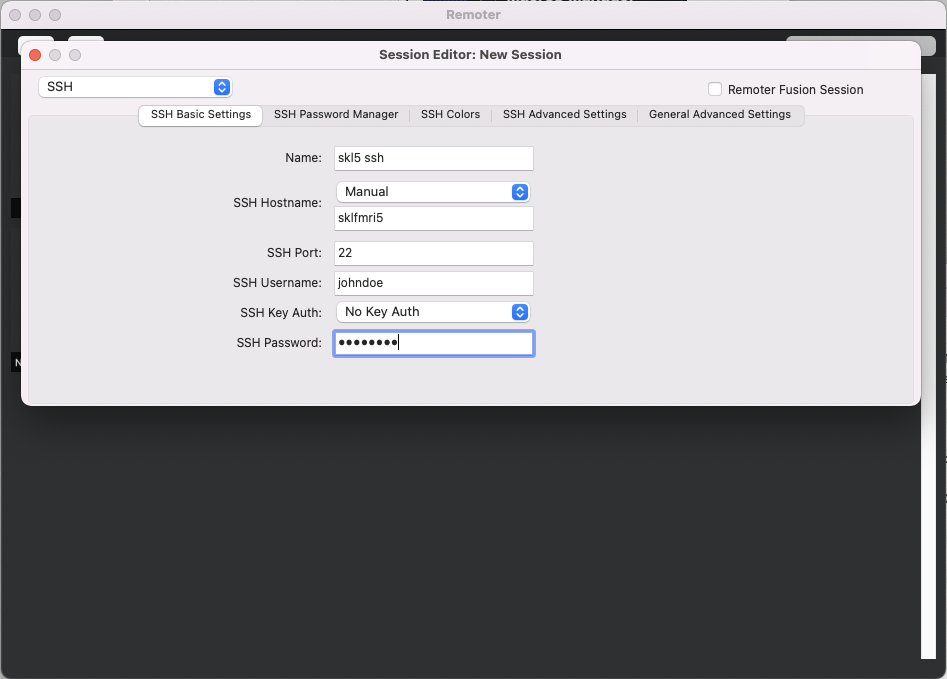
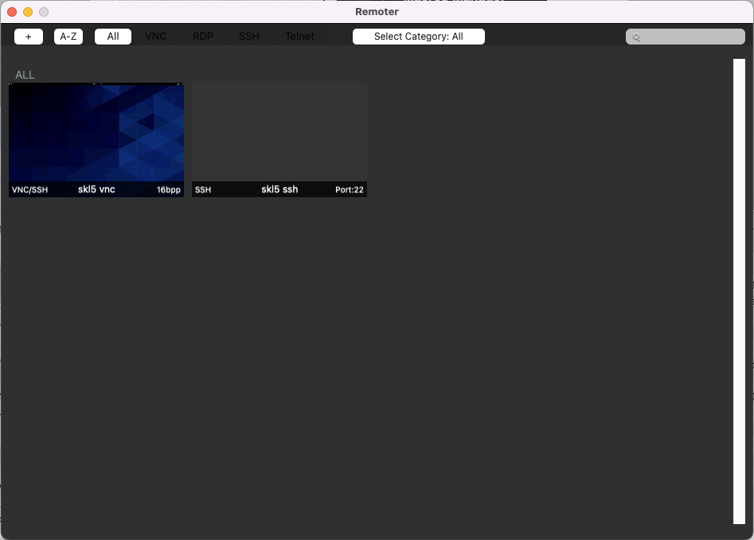

Access Server with Remoter
##########################

First Login
***********

Start your terminal.

.. code
  
  johndoe@MacBook ~ % ssh johndoe@sklfmri5
  The authenticity of host 'sklfmri5 (xxx.xxx.xxx.xxx)' can't be established.
  ED25519 key fingerprint is SHA256:NwuLu+etpZlKq+5drcF3ut/+dKHHCNFPKH8tipbVd4I.
  This key is not known by any other names
  Are you sure you want to continue connecting (yes/no/[fingerprint])? yes
  Warning: Permanently added 'sklfmri5' (ED25519) to the list of known hosts.
  johndoe@sklfmri5's password: 

  Activate the web console with: systemctl enable --now cockpit.socket

  [johndoe@sklfmri5 ~]$ 

Create password for vnc.

.. code-block:: Bash
  
  [johndoe@sklfmri5 ~]$ vncpasswd 
  Password:
  Verify:
  Would you like to enter a view-only password (y/n)? n
  A view-only password is not used
  [johndoe@sklfmri5 ~]$ 
  
Start VNC

.. code-block:: Bash
  
  [johndoe@sklfmri5 ~]$ vncserver :64

  New 'sklfmri5:64 (hycwong)' desktop is sklfmri5:64

  Starting applications specified in /data/home/johndoe/.vnc/xstartup
  Log file is /data/home/johndoe/.vnc/sklfmri5:64.log

  [johndoe@sklfmri5 ~]$ 

.. code-block:: Bash
  
  [johndoe@sklfmri5 ~]$ vncserver -list

  TigerVNC server sessions:

  X DISPLAY #	PROCESS ID
  :102		2008908
  :64		2685669
  [johndoe@sklfmri5 ~]$ 
  
Remoter
*******

Create an SSH session.

Create a VNC session

.. figure:: Remoter-2-VNC.png

You will then see two sessions.

You are ready to go.
