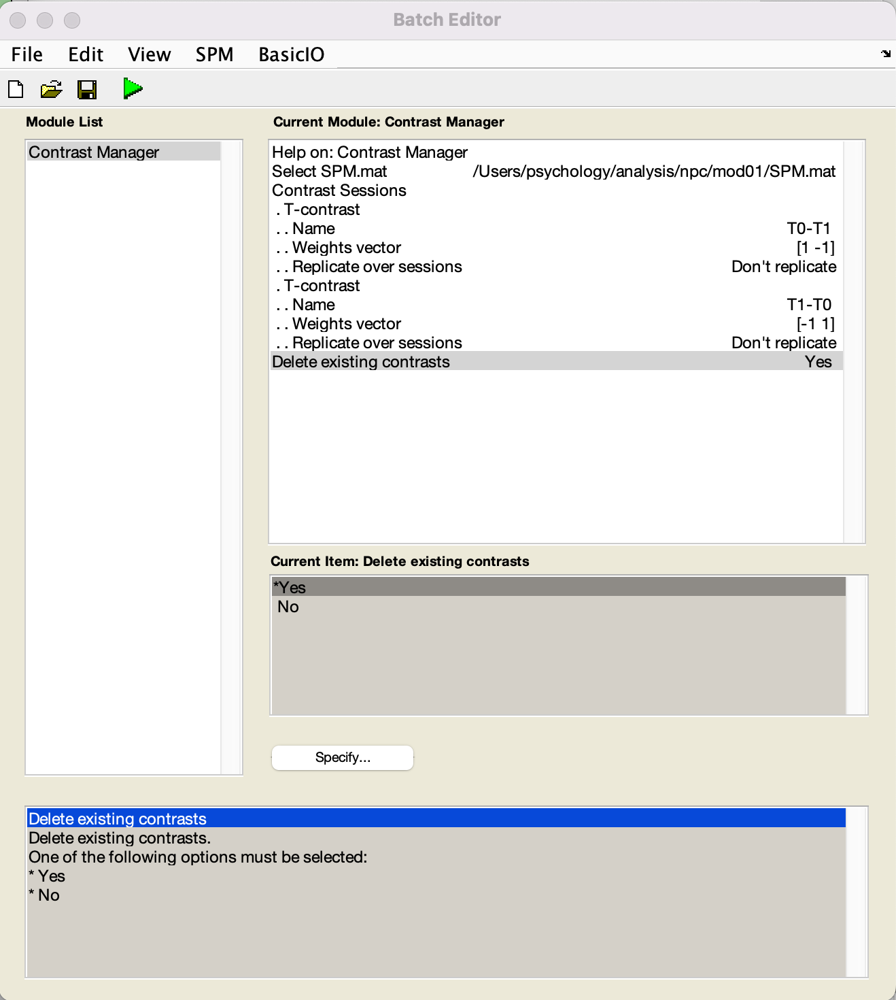

CAT12 Longitudinal
##################

.. note::
    This tutorial assumes we are working on Mac, in the folder ``/Users/psychology/analysis``.
    SPM will be installed in ``/Users/psychology/analysis/spm12``.
    Project folder will be ``/Users/psychology/analysis/npc``.

Download Files
**************

Download `SPM <https://www.fil.ion.ucl.ac.uk/spm/download/restricted/eldorado/spm12.zip>`__ and SPM toolboxes `CAT12 <http://www.neuro.uni-jena.de/cat12/cat12_latest.zip>`__, `TFCE <http://www.neuro.uni-jena.de/tfce/tfce_latest.zip>`__ & `WFU_PickAtlas <https://www.nitrc.org/frs/download.php/10865/WFU_PickAtlas_3.tar.gz>`__. 

Extracting Files
****************

Save all the zip files to ``/Users/psychology/analysis``. Expand the files. Move the folders ``cat12`` and ``TFCE`` to ``spm12/toolbox``. Inside the ``WFU_PickAtlas_3.0.5b`` folder, there are ``wfu_pickatlas``, ``wfu_results`` & ``wfu_tbx_common``. Move the subfolders instead.

Mac Security Issue
******************

.. note::
    Come back to this section if you cannot start SPM.

    You may encounter a message which stops you from runnin spm.

    ``spm_bsplinc.mexmaci64 cannot be opened because the developer cannot be verified.``
    
    This is due to the security and privacy setting of the new macOS.
    
    You can use the commands below to resolve the issue.

:: 
    cd ~/
    sudo xattr -r -d com.apple.quarantine .
    sudo find . -name '*mexmaci64' -exec spctl --add {} \;

Run SPM
*******

Start MATLAB, change to the folder ``/Users/psychology/analysis``.

Your spm12 folder should be here. Right click, Add to Path, Selected Folders.

Longitudinal Segmentation
*************************

The aim for segmentation is to distinguish grey matter from other brain tissues, so that we can estimate the change in grey matter volume afterwards.

The steps are as below:

#. Click ``Batch`` from the main menu
#. Click ``SPM`` -> ``Tools`` -> ``CAT12`` -> ``CAT12: Segment Longitudinal Data`` from the Batch Editor Menu
#. Choose ``Subjects`` -> ``New: Subject`` from the Module Options
#. Click ``Specify`` to specify the images of one subject.
#. Navigate the file selection menu, choose the images. Make sure you choose the images from the same subject.
#. Choose ``Affine Regularisation`` then ``Asian Brain``.
#. Scroll down, find the option ``Surface and thickness estimation``. Choose ``No``.
#. Click the ``Run`` button. 

.. figure:: 05_segment.gif

Wait for an hour. Then you will see the reports as below.

This one is a single session report. 

This one is a longitudinal report, showing the changes in brain volume.

The one above did not show the surface reconstruction, as we skipped the step. Surface reconstruction takes much longer time. For the purpose of experiencing the software, we skipped the step.
 
The one below showed global tissue volumes and their maximal changes. The values could be extracted for other statistical analysis.

Smoothing
*********

After segmentation, we need to smooth the images. The folder ``mri`` contains the segmented images.

The files are prefixed with ``mwp1``, Modulated (m), Warpped (w) & Grey Matter (p1) respectively.

The processing sequence is segmentation, which generates grey matter map.

Then the images were warpped to standard brain template. The shape of individual brains differs from each other. Warpping simply map the brain regions to some standard location.

Modulation corrects for the distortions introduced by warpping.

We will then smooth the images to make it looks blurry. This is due to the fact that after we "normalise" the images, there were still some inaccuracy. Also, the images are still quite noisy, look like there are some speckles. Smoothing could increase the signal-to-noise ratio.

Steps as below:

#. Go back to the ``Main Menu``. Click ``Smooth``, then the ``Batch`` menu will show the ``Smooth`` module. 
#. Choose the images begins with ``mwp1``. 
#. FWHW could be [ 8 8 8 ] or [ 12 12 12 ]. It determines how blurry the images will be.
#. Prefix ``s`` will be added to the files. So they will become ``smwp1``.
#. Done.

Group-Level Statistical Analysis: Design Matrix Specification
*************************************************************

After all the preprocessings, we can do group-level analsis.

First, let's create a new folder for the group analysis.

Remember to copy the preprocessed smwp1 files from the Archive to the ``analysis/npc/data/mri`` folder.

Then invoke the CAT12 menu, choose ``Basic Models``.

You will then see the ``Batch Editor``.

Steps for specifying subjects:

#. Specify Directory. The model will be stored there.
#. Design: Longitudinal data (Flexible factorial)
#. Factor: New Factor
#. First Factor: Name -> subject
#. Second Factor: Name -> time
#. Subjects: New Subject (repeat for number of subjects)
#. First Subject: Scans: Specify ``smwp1sub-xxx_ses-01.nii`` and ``smwp1sub-xxx_ses-02.nii`` from the mri folder
#. Repeat for the rest of the subjects
#. Main effects & Interactions

Them specify the main effects. We will need 2 main effects:
#. First Main effect: Factor number: 2 (It's time effect)
#. Second Main effect: Factor number: 1 (It's subject effect, we actually have no interest in it.)
#. Run button  

Then you will see the design matrix.

The first two column specify the first and second time point. The rest captures subject mean, so that we can establish the within-subject changes.

Group-Level Statistical Analysis: Model Estimation
**************************************************

We will need to run model estimation. 

#. Batch Menu -> ``SPM`` -> ``Stats`` -> ``Model estimation``
#. Module panel: select ``SPM.mat`` from ``mod01``
#. Run

We will then need to specify the contrast.

#. Batch menu -> choose ``SPM`` -> ``Stats`` -> ``Contrast Manager``
#. Module panel: select ``SPM.mat`` from ``mod01``
#. Contrast Sessions: New T-Contrast (x2)
#. Setup as the figure below

After the contrast is estimated, you can then see the preliminary results.

View results
************

From the main menu, click ``Results``. 

You can change the Contrasts and other options for statistical correction from the Results menu.

We used a very relaxed statistical correction here.

Typically, we need to choose cluster-based FWE correction, with a cluster p-value smaller than 0.05. 

TFCE: Threshold-Free Cluster Enhancement (Permutation Test)
***********************************************************

We need to do further statistical analysis based on permutation tests.

It's simple to run the TFCE, which just re-estimate the contrast with other method.

And to view the results, choose from the TFCE menu.

