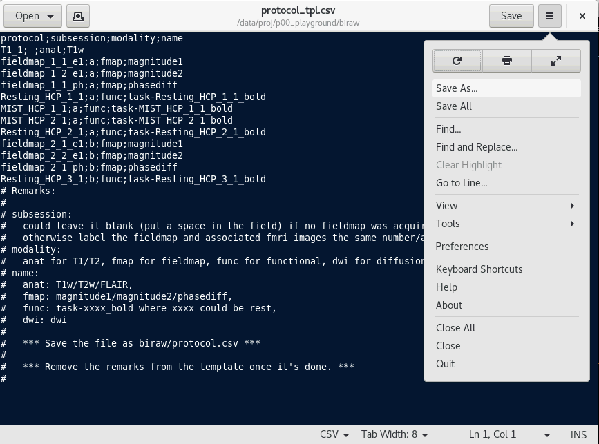

DICOM to BIDS
#############

This section covers the basics of DICOM conversion and the custom-made script to semi-automatically arrange the converted images to BIDS format.

.. note:: You will need to run ``source /data/scripts/bashrc`` to setup the environment.

.. note:: You can copy your data to /data/proj/p00_playground/biraw, and familiarise yourself with the scripts.

Data Acquisition
****************

First thing first. 

You have to be careful when planning for the scanning protocol. The scanning sequences need to be named properly. 
The DICOM header contains several fields, and we will need them to identify the sequence uniquely. 
Following the Garbage-In-Garbage-Out Principle, a chaotic naming of the protocol will lead to a miserable life.

BIDS Naming convention
**********************

Please read details of the specificaion from the section `Modality Specific Files/Magnetic Resonance Imaging <https://bids-specification.readthedocs.io/en/stable/04-modality-specific-files/01-magnetic-resonance-imaging-data.html>`__ of the official BIDS specification.

In general, the imaging data will look like:

::

    sub-CON001
    ├── ses-01
    │   ├── anat
    │   │   ├── sub-CON001_ses-01_T1w.json
    │   │   ├── sub-CON001_ses-01_T1w.nii.gz
    │   │   ├── sub-CON001_ses-01_T2w.json
    │   │   ├── sub-CON001_ses-01_T2w.nii.gz
    │   │   ├── sub-CON001_ses-01_FLAIR.nii.gz
    │   │   └── sub-CON001_ses-01_FLAIR.nii.gz
    │   ├── fmap
    │   │   ├── sub-CON001_ses-01_phasediff.json
    │   │   ├── sub-CON001_ses-01_phasediff.nii.gz
    │   │   ├── sub-CON001_ses-01_magnitude1.json
    │   │   ├── sub-CON001_ses-01_magnitude1.nii.gz
    │   │   ├── sub-CON001_ses-01_magnitude2.json
    │   │   └── sub-CON001_ses-01_magnitude2.nii.gz
    │   ├── func
    │   │   ├── sub-CON001_ses-01_task-stroop_bold.json
    │   │   ├── sub-CON001_ses-01_task-stroop_bold.nii.gz
    │   │   ├── sub-CON001_ses-01_task-rest_bold.json
    │   │   └── sub-CON001_ses-01_task-rest_bold.nii.gz
    │   └── dwi
    │       ├── sub-CON001_ses-01_dwi.bvec
    │       ├── sub-CON001_ses-01_dwi.bval
    │       ├── sub-CON001_ses-01_dwi.json
    │       └── sub-CON001_ses-01_dwi.nii.gz
    └── ...

.. note:: 
  
  Each image file will be accompanied by a *JSON sidecar* which describes the imaging data. 
  Things like SliceTiming, TR, TE, FoV are extracted from the DICOM header stored there.

  The dcm2niix program intelligently extract only those useful information from the DICOM header, which is not as standardised as it should be across different scanner (and scanner software version).

  You will need to modify some of the header information. For example, SliceTiming may be missing from the DICOM, and the Fieldmap Phase Different image will need EchoTime1 and EchoTime2 from the magnitiue1 and magnitude 2 images.

DICOM Conversion
****************

We use dcm2niix for dicom conversion. This is a tool developed by Chris Rorden, which could be downloaded `here <https://github.com/rordenlab/dcm2niix>`__. 

It converts DICOM images to Nifti files, and generate a JSON file which contain necessary headers, including slice timing and diffusion gradients, which are the most important ones, and TR, TE, FoV, etc, which we need to report in the manuscripts. 

The software can make the output files according to the fields in the DICOM header. So before you collect the data, please confirm with the radiologist that the name of the protocol is unique. For instance, if you will acquire three resting-fMRI, they should be named Resting _1, Resting_2 & Resting_3. This also apply to tasks, fieldmaps, and structural scans.

Scripts for DICOM to BIDS
*************************

Three scripts has been written to facilitate the DICOM to BIDS conversion.

.. list-table:: Scripts For DICOM to BIDS Conversion
   :widths: 30 70
   :header-rows: 1
   
   * - Script
     - Function
   * - bisort0.tidydicom.sh
     - Check and tidy up the DICOM files (check for folders which did not conform to the structure)
   * - bisort1.genjson.sh
     - Generate JSON files, create a summary table for all sequences scanned, generate a mapping file.
   * - bisort2.genbids.sh
     - Convert the DICOM files to NIFTI, and sort them according to the mapping file.

bisort0.tidydicom.sh
====================

.. note:: If your folders have been sorted, you could skip this step.

In case your DICOM data has not been named properly (i.e. sub-xxx/ses-xxx), this script helps you to search for and rename folder structure.

.. list-table:: 
  :widths: 50 50
  :header-rows: 1

  * - From this:
    - To this:
  * - ::

        p21_resilience
        ├── biraw
        │   ├── RMRI001  (single session, without ses-xxx subfolder)
        │   ├── CHAN^SIU_MING (participant name)
        │   │   ├── 20190228 (scan date, first)
        │   │   ├── 20201225 (scan date, second)
        │   │   └── ...
        │   └── ...
        └── ...

    - ::

        p21_resilience
        ├── biraw
        │   ├── sub-RMRI001
        │   │   ├── ses-01
        │   │   └── ...
        │   ├── sub-RMRI002
        │   │   ├── ses-01
        │   │   └── ses-02
        │   └── ...
        └── ...

Scenario:
---------

You will be collecting DICOM files from two sources: clinical or research scanner.

When the DICOMs are coming from a research scanner, you could use the participant ID instead of participant name on site, which will then be stored in the DICOM header.

The name will follow some conventions according to the practices of the radiologists in that particular hospital. In general it will be like SURNAME^LAST_NAMES.

Sometimes, you may pick up some dataset collected elsewhere, and you will need to convert the participant names into participant IDs. This script is intended to help with that. 

So if you collected the data by yourselves, please label the participants with the BIDS convention. That is, sub-001 or sub-GRP001.

Please also label the participants with equal-length string. Don't label them as sub-1, sub-2, ... sub-10, ... sub-100. Instead make it sub-001, sub-002, sub-010, sub-100.

Using the script:
-----------------

You have to run the script twice. During the first run, the script will scan the folder $proj/biraw for folders which did not follow $proj/biraw/sub-xxx/ses-xxx naming. 
Then you will need to 

``bisort0.tidydicom.sh -gen`` will extract the names of those folder if they contain DICOM files and store the template to a mapping file.
``gedit biraw/bisort0_template.csv`` will open the template, you then need to save it as ``biraw/bisort0.csv``.
``bisort0.tidydicom.sh -tidy`` will re-structure the folders according to the mapping file ``biraw/bisort0.csv``.

The mapping file looks like:

::

  CON001/pre;sub-CON001/ses-pre
  CON001/post;sub-CON001/ses-post
  MDD001;sub-MDD001/ses-01

The rule for sorting the folders are:

#. If the subject folder xxx contains DICOM file but subfolders, name it as sub-xxx/ses-01
#. If the subject folder sub-xxx contains DICOM file but subfolders, name it as sub-xxx/ses-01
#. If the subject folder xxx contains sub-folder yyy, name it as sub-xxx/ses-yyy
#. If the subject folder xxx contains sub-folder ses-yyy, name it as sub-xxx/ses-yyy
#. If the subject folder sub-xxx contains sub-folder yyy, name it as sub-xxx/ses-yyy
#. If the subject folder sub-xxx contains sub-folder ses-yyy, name it as sub-xxx/ses-yyy

.. note:: The script will traverse 2 levels only.

bisort1.genjson.sh
====================

The script will:

#. extract information from JSON sidecar, without generating NIFTI files. (localisers will be excluded)
#. generate a summary table for each sequence of each subject. (biraw/bi_summary.csv)
#. suggest a mapping file for renaming the images to BIDS format. (biraw/protocol_tpl.csv)

.. note::

  Prerequisite:
    1. Proper DICOM structure
    2. biraw/participants.tsv (Follow BIDS format, the scripts will only process the subjects contained in this file.)

The ``participant.tsv`` could be as simple as:

::

  participant_id
  sub-001
  sub-002
  ...

The command ``bisort1.genjson.sh -gen`` will generate the file ``participant.tsv`` for you.

And you should see `Modality agnostic files/Participants File <https://bids-specification.readthedocs.io/en/stable/03-modality-agnostic-files.html#participants-file>`__ for details.

After ``bisort1.genjson.sh -all``, you will have a protocol template file. You will need to modify the template (biraw/protocol_tpl.csv) save as (biraw/protocol.csv).

The final ``protocolmap.csv`` should look like this:

The script will (hopefully) fill up the modality according to the protocol.

The file contains 4 columns. 
#. The first column is the output filename after dcm2niix. 
#. The second one is subsession. If no fieldmap or only one fieldmap is involved, keep it empty (a space). 
#. The third column is the modality. Could be anat (T1w/T2w/FLAIR), fieldmap (fmap), functional (func) or dwi/dti (dwi)
#. The fourth column is the suffix.

.. list-table:: Suffix for different modalities
   :widths: 30 70
   :header-rows: 1
   
   * - Modality
     - Suffix
   * - T1/MPRAGE
     - T1w
   * - T2
     - T2w
   * - FLAIR
     - FLAIR
   * - BOLD fMRI
     - task-<taskname>_bold
   * - Diffusion Imaging
     - dwi

.. note::
  When multiple fieldmaps have been acquired for different protocols, specify the fmap, func and/or dwi. 
  Sometimes we may pull the participants out of the scanner and continue the scanning after they did something else.
  For example, we stress the participant, pull him out for stress recovery, then scan some post-recovery protocols.
  The first fieldmap will apply to the first "sub-session". Label the subsession as ``a``, the session name will become ``ses-01a``.
  The second one will apply to the second "sub-session". Label it as ``b`` and the script will name it as ``ses-01b``.

The summary table (biraw/bi_summary.csv) will be useful for checking if there were any mistake 
in the scan sequence, such as wrong parameters.

The summary file will looks like:

bisort2.genbids.sh
====================

The script will convert and rename the nifti files generated from dcm2niix, according to the protocol mapping file, and modify the fieldmap JSON file according to the file structure.

The script assumes the file participant.tsv file exists in the biraw folder.

The command below will generate bids for all subjects.

.. code-block:: Bash

  bisort2.genbids.sh all
  
The command below will only generate bids for two subjects.

.. code-block:: Bash

  bisort2.genbids.sh sub-001 sub-002

The following data structure will be generated:

::

    p21_resilience
    ├── bids
    │   ├── sub-001
    │   │   ├── ses-01
    │   │   │   └── anat
    │   │   ├── ses-01a
    │   │   │   ├── fmap
    │   │   │   └── func
    │   │   ├── ses-01b
    │   │   │   ├── fmap
    │   │   │   └── func
    │   │   └── ...
    │   └── ...
    └── ...

.. note::

  The "IntendedFor" field will be added to the JSON file, such that the fmriprep pipeline could recognise which fmap should be apply to which func/dwi images.

  ::

    {
          "IntendedFor": [ "ses-01a/func/sub-RMRI001_ses-01a_task-mist1_bold.nii.gz",
                          "ses-01a/func/sub-RMRI001_ses-01a_task-mist2_bold.nii.gz",
                          "ses-01a/func/sub-RMRI001_ses-01a_task-rest1_bold.nii.gz",
                          "ses-01a/func/sub-RMRI001_ses-01a_task-rest2_bold.nii.gz"],

          "Modality": "MR",
          "MagneticFieldStrength": 3,
          ...

Manual Conversion with dcm2niix
*******************************

The program takes various input parameters. For example, I find this command useful for post-conversion sorting.

.. code-block:: Bash

  dcm2niix -i y -b y -z y -o . -f %f/%t/%p_%r bids/sub-001

Explanation:

.. list-table:: 
  :widths: 50 50
  :header-rows: 1
  
  * - Argument
    - Explanation
  * - -i y
    - ignore 2D images, such as localisers
  * - -b y
    - generate BIDS compatible JSON files
  * - -z y
    - generate nii.gz (compressed nifti), instead of nii
  * - -o .
    - output to current folder
  * - -f bids/%f/%t/%p_%r
    - name of the output file (explain later)

The output files of the -f option above will create a folder bids, and an inner folder sub-001, and an inner folder with names as the scan date and time. The output files william be named as the name of the scanning protocol and the instance number.

Assuming that the sub-001 is scanned on 2022-Jan-06 at 14:05:22, and the DICOM contains the sequences as the first column, the output files will be the right column:

.. list-table:: 
  :widths: 50 50
  :header-rows: 1
  
  * - Protocol Name (%p)
    - Output
  * - T1
    - ./bids/sub-001/20020106140522/T1_1.nii.gz
  * - fieldmap_1
    - ./bids/sub-001/20020106140522/fieldmap_1_1.nii.gz

      ./bids/sub-001/20020106140522/fieldmap_1_2.nii.gz

      ./bids/sub-001/20020106140522/fieldmap_ph_1.nii.gz
  * - resting_1
    - ./bids/sub-001/20020106140522/resting_1_1.nii.gz
  * - stress_1
    - ./bids/sub-001/20020106140522/stress_1_1.nii.gz
  * - stress_2
    - ./bids/sub-001/20020106140522/stress_2_1.nii.gz
  * - resting_2
    - ./bids/sub-001/20020106140522/resting_2_1.nii.gz
  * - fieldmap_2
    - ./bids/sub-001/20020106140522/fieldmap_2_1.nii.gz

      ./bids/sub-001/20020106140522/fieldmap_2_2.nii.gz

      ./bids/sub-001/20020106140522/fieldmap_ph_1.nii.gz
  * - resting_3
    - ./bids/sub-001/20020106140522/resting_3_1.nii.gz

As you can see here, only fieldmaps will have 2 instances. They are two EchoTimes obtained within 1 TE.

And we are ready for organising the images to the BIDS structure.
